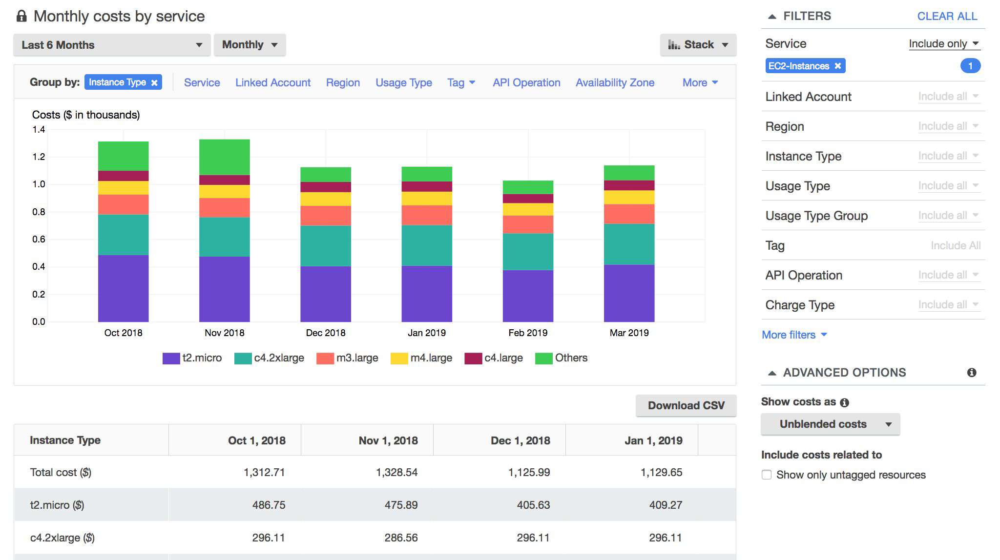
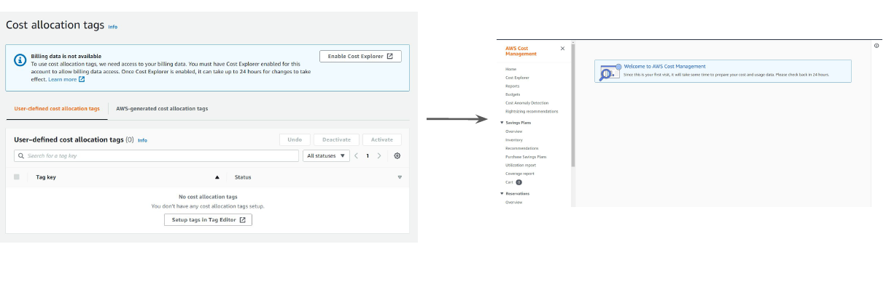

AWS Cost Explorer has an easy-to-use interface that lets you visualize, understand, and
manage your AWS costs and usage over time.

AWS Cost Explorer is not enabled by default and you will have to explicitly enable it from
the Billing console

