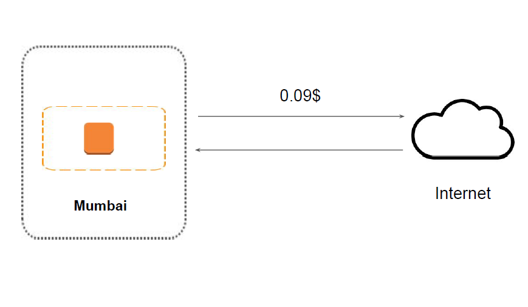
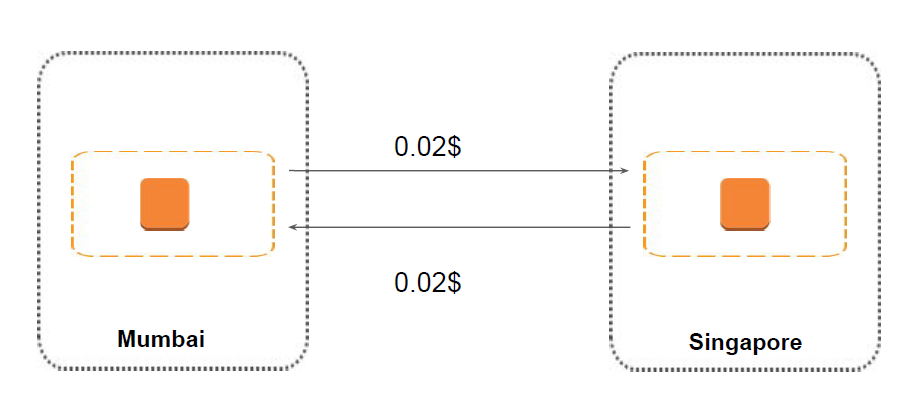
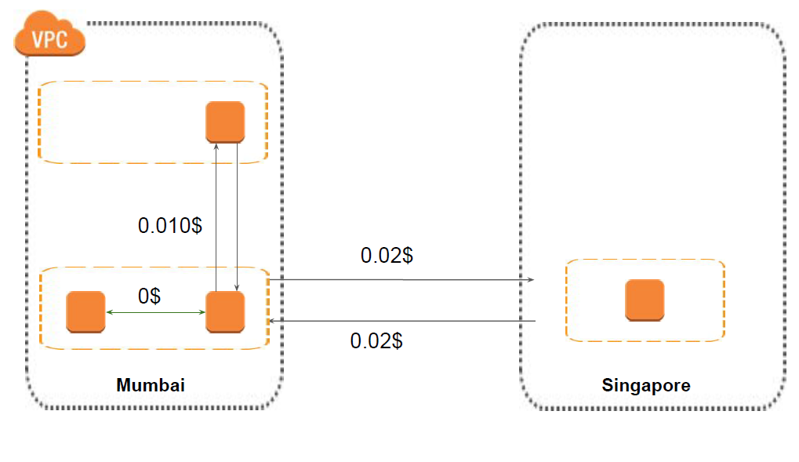

## Typical Types of Data Transfer
AWS data transfer costs are the costs associated with transferring data either with-in AWS
between various AWS services like EC2 and S3 or AWS and the public internet.
i) Internet
ii) Region to Region
iii) Inter Availability Zone
iv) VPC Peering

## Data Transfer - Internet
If the data is going outside of the AWS towards the public internet, it will be charged at
0.09$/GB up to first 10 TB.
Internet = From AWS Public IP to Non-AWS Public IP
Above definition excludes traffic between two AWS Regions or traffic between public IP of the
same AWS region.
There is no Data Transfer charge between Amazon EC2 and other Amazon Web Services
within the same region (i.e. between Amazon EC2 US West and Amazon S3 in US West).

## Data Transfer -Region Level
Within an Availability Zone:
The data transfer costs in the same region and within the same availability zone is zero, with one
condition. You must be using a private IP address
Across Availability Zone in same region:
The data transferred between AWS services which are located in the same region but in
different AZ is considered as regional data transfer and is charged at $ 0.01/GB (outgoing data
transfer).
Peering Connect - 0.0.1$ per GB
Inter-Region Data Transfer
The data transfer costs between the region is charged 0.02$ per GB

## Diagrammatic Representation

