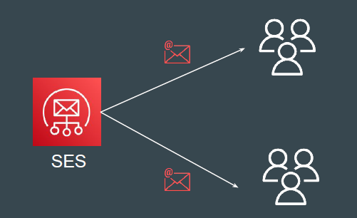
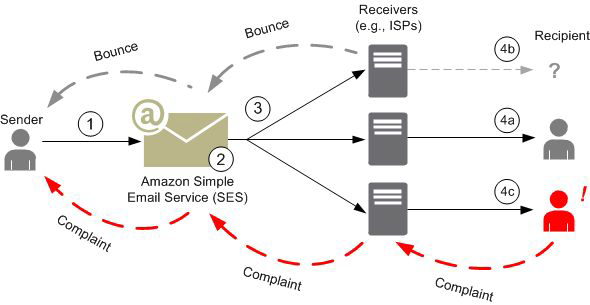

Amazon SES is an email platform that provides an easy, cost-effective way for
you to send and receive email using your own email addresses and domains.
Many organization has generic emails like noreply@example.com which is used
to send emails to users upon registration or other use-cases.

## How email sending works in Amazon SES

- Email sender makes a request to SES to send email to recipients.
- If the request is valid, SES accepts the email.
- SES sends the message over the Internet to the recipient's receiver.

Bounce Notifications (email not exist) & Complaints (feedback) are sent back to
SES which then forwards it to the sender.

